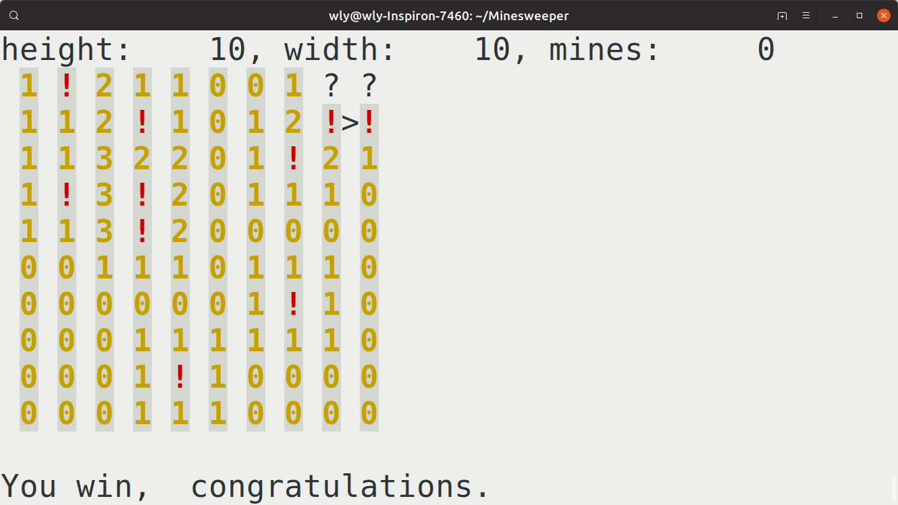

# MINESWEEPER by C language
### character edition
This is a rough minesweeper runtime by C language.  
using standard C language (C89, taught by HIT)  
using a third-party library ncurses, compiled in gcc-8.3, Debian, to use the link library curses.h in functions  

## Developing log
2019.04.24   
build kernel and basic ui.   
build passed.   
remove all files used on windows.   
add gaming strategy : use curses.h for non-buff input  
build ncurses on Linux operating system.  
add 0-sweeping mode(in function mine()), but still bugged  
preparing for timer  
  

